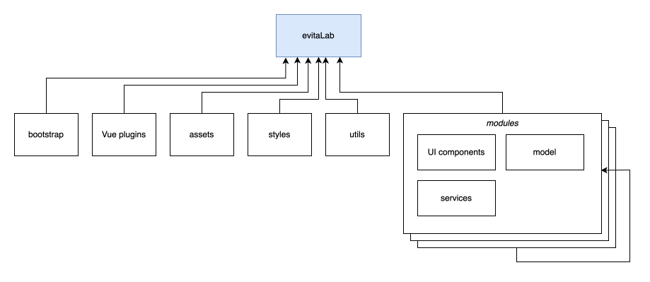

# Codebase architecture

evitaLab is a pure browser SPA built with Vue 3 (Composition API), TypeScript, Vuetify and Vite.
This page describes how the application is wired together. For a per-module reference see the
[module catalog](modules/index.md).



## Source layout

```
src/
├── main.ts                  # bootstrap entrypoint
├── Lab.vue                  # root component (renders <router-view/>)
├── LabRunMode.ts            # STANDALONE | DRIVER
├── ModuleRegistrar.ts       # interface implemented by modules with DI needs
├── ModuleContextBuilder.ts  # DI container used during bootstrap
├── modules/                 # all evitaLab modules (see module catalog)
│   └── modules.ts           # ordered list of module registrars
├── vue-plugins/             # global Vue plugin setup (vuetify, router, i18n, pinia, …)
├── styles/                  # global SCSS (colors, Vuetify settings, markdown, …)
├── utils/                   # generic utilities (see below)
└── assets/                  # static resources
```

## Run modes

evitaLab runs in one of two modes, resolved from the `VITE_RUN_MODE` env variable
(`src/LabRunMode.ts`):

- **`STANDALONE`** (default) — regular web app served under the `/lab` path, uses web history
  routing, renders `StandaloneMainView.vue` (with welcome screen).
- **`DRIVER`** — embedded inside the [evitaLab Desktop](https://github.com/FgForrest/evitalab-desktop)
  app as a driver. Served under `/`, uses hash history routing, renders `DriverMainView.vue`,
  and delegates some functionality (e.g. notifications via `RemoteToaster`) to the desktop shell
  through IPC (`desktop-support` module).

Anything that behaves differently per mode must consult `EvitaLabConfig.runMode` — never
`import.meta.env` directly (the only exception is `vue-plugins/router.ts`, which resolves the mode
before the config exists).

## Bootstrapping

`src/main.ts` drives the startup sequence:

1. `createApp(Lab)` creates the Vue app.
2. Web fonts are loaded (`vue-plugins/webfontloader.ts`).
3. Global Vue plugins are registered: Vuetify, CodeMirror, vue-toastification, Pinia, vue-i18n,
   vue-router, Luxon extensions, ApexCharts.
4. A `ModuleContextBuilder` is created and every registrar from `src/modules/modules.ts` is
   `register()`-ed **in order** (async, sequential).
5. The app is mounted to `#app`. In `DRIVER` mode the router is pushed to `/`.

### Module registration and dependency injection

Vue's `provide`/`inject` works only inside components, but services are constructed during
bootstrap. `ModuleContextBuilder` bridges this gap:

- `provide(injectionKey, resource)` — registers the resource both into the Vue app
  (`app.provide`) for components **and** into an internal index for other module registrars.
  The injection key's `Symbol` description must be globally unique — duplicates throw
  `InitializationError`.
- `inject(injectionKey)` — used by module registrars to obtain services provided by previously
  registered modules.

A module that provides or consumes services implements `ModuleRegistrar`:

```ts
export class MyModuleRegistrar implements ModuleRegistrar {
    async register(builder: ModuleContextBuilder): Promise<void> {
        const evitaClient: EvitaClient = builder.inject(evitaClientInjectionKey)
        builder.provide(myServiceInjectionKey, new MyService(evitaClient))
    }
}
```

and must be added to `src/modules/modules.ts`. Base generic modules (`config`, `storage`,
`connection`, `database-driver`, `workspace`, `notification`) come first; UI feature modules after
them. A registrar can only inject what was registered before it.

In components, services are obtained through per-service helper functions built on
`mandatoryInject` (`src/utils/reactivity.ts`), which throws `InitializationError` when the key was
never provided:

```ts
const workspaceService: WorkspaceService = useWorkspaceService()
```

See [guidelines — dependency injection](guidelines.md#dependency-injection) for the conventions
around defining injection keys.

## Routing

`vue-plugins/router.ts` defines a single route (`/lab` in standalone, `/` in driver mode) rendering
`modules/workspace/view/Layout.vue` with the mode-specific main view as a lazy-loaded child. There
is intentionally no per-feature routing — all navigation happens inside the workspace via
[tabs](workspace-and-tabs.md). URL query parameters are used only to carry system properties and
shared/demo tab requests (parsed and stripped by `EvitaLabConfig.load()`).

## State management

- Almost all state lives in plain TypeScript service classes (singletons provided via DI).
- Pinia is used sparingly, where reactivity across unrelated components is needed:
  `workspaceStore` (tabs, tab data, tab history, status bar state) and `welcomeScreenStore`.
  Stores are internal to their module — other modules access the state through the module's
  service (e.g. `WorkspaceService`), never through the store directly.
- Domain model classes are immutable where practical, using
  [Immutable.js](https://immutable-js.com/) collections (`List`, `Map`, `Set`) in models and
  service APIs.

## Vue plugins

Global Vue plugin configuration lives in `src/vue-plugins/`:

| File | Purpose |
|------|---------|
| `vuetify.ts` | Vuetify setup: single dark theme with evitaLab palette (`primary-dark`, `primary-light`, `primary-lightest`, `gray-light`, …) and opinionated component defaults (density, variants). Labs components `VDateInput`, `VTimePicker`, `VPicker` are registered explicitly |
| `router.ts` | vue-router setup, run-mode-dependent history & root path |
| `i18n.ts` | vue-i18n setup, `SupportedLocale` enum, messages from `modules/i18n/en.json` |
| `pinia.ts` | Pinia instance |
| `codemirror.ts` | vue-codemirror global defaults |
| `toastification.ts` | vue-toastification defaults (used by `LocalToaster`) |
| `luxonExtensions.ts` | Luxon date/time helpers |
| `webfontloader.ts` | async font loading |

## Utilities

`src/utils/` contains generic, module-independent helpers: `reactivity.ts` (`mandatoryInject`),
`object.ts`, `string.ts`, `text.ts`, `number.ts`, `bigint.ts`, `enum.ts`, `uuid.ts`,
`dateTime.ts`, `duration.ts`, `GroupByUtil.ts`, `JsonUtil.ts`. Prefer extending these over
introducing new ad-hoc helpers inside modules.

## Auto-generated files

Do not edit by hand:

- `src/auto-imports.d.ts`, `src/components.d.ts`, `src/typed-router.d.ts` — generated by Vite
  plugins (`unplugin-auto-import`, `unplugin-vue-components`, `unplugin-vue-router`).
- `src/modules/database-driver/connector/grpc/gen/` — generated gRPC/protobuf model, regenerated
  from the evitaDB repository (see the `generate-evitadb-client` workflow in `buf.gen.yaml`).
