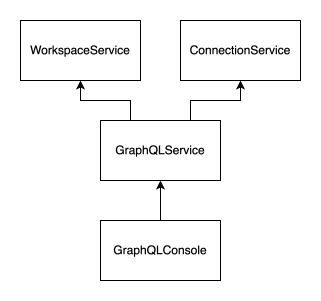

# Guidelines

Rules and conventions for writing evitaLab code. Each module respects the **vertical slice
architecture** — a feature's components, models and services live together in its module
(see [module catalog](modules/index.md)). We are big fans of **immutability** (where it makes
sense) and Domain-Driven Design, and we try to build the codebase using these practices.

## TypeScript conventions

- **Explicit types everywhere** — declare types for variables, parameters and return values even
  when inferable (`const catalog: CatalogStatistics = ...`). This is the prevailing codebase style.
- Prefer `undefined` over `null`; check with `== undefined`.
- Domain model classes are immutable: `readonly` properties, initialization in the constructor,
  [Immutable.js](https://immutable-js.com/) collections (`List`, `Map`, `Set`) instead of mutable
  arrays/maps in models and service APIs.
- Use evitaLab data types (`modules/database-driver/data-type/`) for evitaDB values — never raw
  strings/numbers for `BigDecimal`, date-times, locales, currencies, UUIDs etc.
- Enums are string-valued (`enum TabType { EntityViewer = 'entityViewer', ... }`).
- Errors extend `LabError` (`modules/base/exception/`); throw `UnexpectedError` for "should not
  happen" states.
- Every class, interface, type and Vue component gets a short JSDoc block describing its purpose.
  Do **not** put implementation-plan commentary into source files — extended documentation belongs
  in `documentation/`.

### Fixing type errors — never weaken types to get to green

`yarn typecheck` is a real gate at zero errors. When the compiler reports an
error, fix the cause, do not silence the symptom:

- **Forbidden by default:** `any`, `as unknown as X`, double casts, `!`
  non-null assertions, `@ts-ignore`, `@ts-expect-error`, loosening a signature
  to `object`/`Function`, or deleting a failing usage instead of understanding it.
- When two types disagree, decide **which one tells the truth** and fix the
  other. The grpc gen files (`connector/grpc/gen/`) are ground truth for wire
  data; the model classes (`request-response/`) are ground truth for the internal
  model. Never hand-edit the gen files — regenerate them.
- `Ref<T>` vs `T` mismatches usually mean a missing `.value` — often a real
  runtime bug, so verify the affected UI flow after fixing.
- gRPC enum-name↔value mismatches: convert explicitly
  (`GrpcEnum[name as keyof typeof GrpcEnum]`), never cast the array.
- **Last resort only** (a genuinely-wrong upstream library typing): a single,
  narrowly-scoped `@ts-expect-error` **with a comment naming the upstream issue**
  — never bare, never `@ts-ignore`.
- If a compiler-forced change alters a code path (added guard, `.value` unwrap,
  enum conversion), add/extend a regression test under `test/`.

## Naming conventions

- Classes/services/models: `PascalCase`, one class per file, file named after the class.
- Injectable service pattern: `MyService` + `myServiceInjectionKey` + `useMyService()`.
- Tab classes: `<Feature>TabDefinition/TabParams/TabParamsDto/TabData/TabDataDto/TabFactory`.
- Shared Vue components: `V` prefix (`VLabDialog`); feature components without prefix.
- i18n keys: camelCase, namespaced per module (see [i18n](i18n.md)).

## Code architecture

### Component structure

We use [Single-File Components](https://vuejs.org/guide/scaling-up/sfc.html) with the
[Composition API](https://vuejs.org/api/composition-api-setup.html) and section order:

- `script` (setup)
- `template`
- `style`

### Component setup structure

Each `setup` portion of a component should follow this ordering:

- imports
- component constants
- injection of services
- props/emit definition
- refs/computed/functions

### MVVM for complex components

Complex components that access data should adhere to the
[Model-View-ViewModel architecture](https://en.wikipedia.org/wiki/Model%E2%80%93view%E2%80%93viewmodel),
preferably in conjunction with the [mediator pattern](https://en.wikipedia.org/wiki/Mediator_pattern):
a custom injectable service for the component (or component tree) abstracts access to generic
services (`EvitaClient`, `WorkspaceService`, …). Components hold only view state; queries, data
transformation and orchestration belong to the service. Example: `EntityViewerService` mediates
between the entity viewer components and query builders/executors.



### Dependency injection

Each injectable service exports an injection key and a helper:

```ts
export const serviceInjectionKey: InjectionKey<Service> = Symbol('service')

export function useService(): Service {
    return mandatoryInject(serviceInjectionKey)
}
```

- The `Symbol` description must be globally unique (enforced at bootstrap).
- Services are constructed and provided in the module's `ModuleRegistrar`
  (see [architecture](architecture.md#module-registration-and-dependency-injection)).
- Constructor injection only — services receive their dependencies as constructor arguments.
- For **component-tree** DI (parent component providing context to descendants), create a
  `dependencies.ts` file next to the components with `provideX`/`injectX` functions wrapping the
  keys, so keys are not spread across components (examples:
  `modules/entity-viewer/viewer/component/dependencies.ts`,
  `modules/traffic-viewer/components/dependencies.ts`).

### Where logic belongs

- Components: rendering + small UI logic.
- Feature services: feature business logic, calls to `EvitaClient`.
- `EvitaClient`/driver: all server communication (see [database driver](database-driver.md)).
- Use the client directly in a component only for truly tiny logic.

### Encapsulate a responsibility in its own type

When a class starts to own a distinct, self-contained responsibility with its own state and behaviour
(a cache, a registry, a poller, a converter, a state machine…), give it its **own type** and hold an
instance of it — do not scatter raw `Map`s, arrays and ad-hoc helper functions across the host class.
The host delegates to thin wrappers; the collaborator owns its data and the operations over it.

- **A field's type should carry its invariants.** Prefer a small dedicated class/interface over a bare
  `Map<string, …>` or loosely-typed record once the structure has rules of its own (keying scheme,
  paired register/unregister, fire-on-change, cache-through fetch). This keeps the host thin, keeps each
  collaborator single-purpose and testable in isolation, and makes the pattern uniform across siblings.
- **Keep transport/framework coupling out of the collaborator.** Pass what it needs in — e.g. a fetch
  thunk rather than a client reference (see the cache-through accessor pattern in
  [database driver](database-driver.md#caching--change-callbacks)).
- **Follow the established sibling.** If a comparable collaborator already exists, mirror its shape
  (naming, method surface, id/callback conventions) instead of inventing a parallel style.

This is the same instinct as *Where logic belongs*, applied one level down: just as logic is placed in
the layer that owns it, state is placed in the type that owns it.

## UI

Use Vuetify components as the base and the custom component set documented in
[UI components](ui-components.md) — dialogs (`VLabDialog`/`VFormDialog`), tab toolbars
(`VTabToolbar`), properties tables, lazy iterators, tree items, markdown, code editors, etc.

Key rules:

- All tab windows must fill all available space.
- Use `VListItemDivider` in every non-menu list.
- Use lazy iterators (`VListItemLazyIterator`, `VExpansionPanelLazyIterator`) for potentially long
  lists.
- Use `mdi-*` icons; keep the icon of a feature consistent across menu items, tabs and toolbars.

### Forms

We use built-in Vuetify [forms](https://vuetifyjs.com/en/components/forms/) with built-in
[validation rules](https://vuetifyjs.com/en/components/forms/#rules). For forms in dialogs use
`VFormDialog`, which already handles validation, submit state and reset.

## Error handling

All service/`EvitaClient` calls in a component must be wrapped in try-catch so the component can
react to errors — usually by calling `toaster.error(...)` and providing fallback values:

```ts
const toaster: Toaster = useToaster()

try {
    catalogs.value = await evitaClient.getCatalogNames()
} catch (e: any) {
    await toaster.error(t('explorer.notification.couldNotLoadCatalogs'), e)
    catalogs.value = Set()
}
```

- Toast titles come from i18n; pass the caught error as the second argument (the toaster can open
  the error-viewer tab with details).
- Services generally let errors propagate to the calling component; the driver already transforms
  transport errors into `LabError` types.
- Never swallow errors silently.

## Localization

All user-facing strings go through vue-i18n — no hardcoded texts in templates. See
[i18n](i18n.md) for key structure and usage patterns.

## Asynchronicity

- Service methods talking to the server are `async`; avoid fire-and-forget — `await` and handle
  errors.
- Long-running server operations report progress via async iterables or `TaskStatus` polling
  (see [database driver](database-driver.md#long-running-operations)).
- Register/unregister change callbacks symmetrically in `onMounted`/`onUnmounted` (same for
  `Keymap.bind`/`unbind`).

## Documentation

Document every new Vue component, class, type and interface with JSDoc. Any new or changed
functionality **must be reflected** in `documentation/developer/` (this directory) — new modules
belong in the [module catalog](modules/index.md), new shared components in
[UI components](ui-components.md), new recipes in [recipes](recipes.md).

## Git

### Branches

We use 3 types of branches:

- `master` — released versions only
- `dev` — current development; target of feature branches
- feature branches — created from `dev` for each issue (bug fix or feature)

For hotfixes, a bug-fixing branch may be created from `master`, but it must not do more than fix a
bug in a non-breaking way.

### Commits

We use [conventional commits](https://www.conventionalcommits.org/en/v1.0.0/) for commit messages
and pull requests:

- commits are more transparent,
- GitHub CI/CD derives versions from them (see [build & tooling](build-and-tooling.md)).
