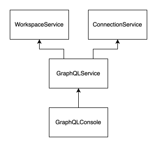

# Guidelines

Basic rules
Each module should respect the vertical slice architecture.
We are also big fans of immutability (where it makes sense) in Domain-Driver-Design, so we try to build the codebase using
these practices.

## Code architecture

### Component structure

We use the [Single-File Components](https://vuejs.org/guide/scaling-up/sfc.html) and
[Composition API](https://vuejs.org/api/composition-api-setup.html#composition-api-setup) with the following order for
better orientation:

- `script`
- `template`
- `style`

### Component setup structure

Each `setup` portion of a component should follow ordering:

- imports
- component constants
- injection of services
- props/emit definition
- refs/computed/functions

Complex components that access data should adhere to the [Model-View-ViewModel architecture](https://en.wikipedia.org/wiki/Model%E2%80%93view%E2%80%93viewmodel),
preferably in conjunction with the [mediator pattern](https://en.wikipedia.org/wiki/Mediator_pattern) in the form of
custom service for the component to abstract access to generic services.



### Dependency injection

Each service that should be injectable should export an injection key:

```ts
export const serviceInjectionKey: InjectionKey<Service> = Symbol('service')
```

and helper method for injecting the service into a component:

```ts
export function useService(): Service {
    return mandatoryInject(serviceInjectionKey)
}
```

For component tree dependency injection a `dependecies.ts` file should be created where the components for a feature are
places with proper injection keys and `provideX` and `injectX` methods so that the keys are not spread across components.

## UI

### Base UI components

#### Dialogs

Use `VLabDialog` for each new dialog that you are creating. Alternatively, use `VFormDialog` for form dialogs 

There are also helper components for dialogs:

- VAlternativeActionDialogButton
- VCancelDialogButton
- VConfirmDialogButton

#### Tab windows

All tab windows must fill all available space.

Use `VTabToolbar` for toolbars within tab window content.

#### Lists

Use `VListItemDivider` for delimiting list items in **each** non-menu lists.

Use `VListItemLazyIterator` if you need client-side with "load next" pagination for lists. Usually useful for
optimizing GUI rendering for lots of components.

#### Expansion panels

Use `VExpansionPanelLazyIterator` if you need client-side with "load next" pagination for expansion panels. Usually useful for
optimizing GUI rendering for lots of components.

#### Markdown

Use `VMarkdown` for rendering markdown texts.

#### Properties

Use `VPropertiesTable` for displaying properties of object etc.

#### Trees

Use `VTreeViewItem` and `VTreeViewEmptyItem` for constructing tree menu structures.

#### Code editor

Use `VQueryEditor`, `VInlineQueryEditor` or `VPreviewEditor` for code/text editor behaviour.

Use `VExecuteQueryButton` as special button for executing queries in conjunction with query editor.

#### Date and time

Primarily use Vuetify date and time components. For datetime component, use the custom `VDateTimeInput`.

## Toast notifications

For toast notifications, inject `useToaster()`. It provides methods for different types of notifications.

### Error handling

All service/EvitaClient calls in a component must be wrapped in a try-catch clause so that the component can react 
accordingly to any errors. Usually it means calling `toaster.error(...)` and providing some default values or fallback
logic for the component.

### Forms

We use the built-in Vuetify [forms](https://vuetifyjs.com/en/components/forms/). For forms in dialogs, check `VFormDialog`.

#### Validations

We use the built-in Vuetify [validation rules](https://vuetifyjs.com/en/components/forms/#rules). In the `VFormDialog`,
there is already built-in logic for proper validation.

## Git

### Branches

We use 3 types of branches:

- `master`
- `dev`
- feature branches

The `master` branch is for the released versions of the evitaLab only. The `dev` branch is where the current unreleased
code is at, and to where the feature branches are merged into. Finally, feature branches are created for each issues
to fix a bug or create new feature. These are then merged into the `dev` branch for eventual release.

When fixing a bug or creating new feature, **always** create new feature branch from the `dev` branch. Or for hotfixes,
create new bug fixing branch from the `master`, but such branch cannot do more than fix a bug in non-breaking way.

### Commits

We use [conventional commits](https://www.conventionalcommits.org/en/v1.0.0/) for Git commit messages and pull requests
for 2 reasons:

- the commits are more transparent
- we have GitHub CI/CD hooked onto it, to automatically build and version the evitaLab